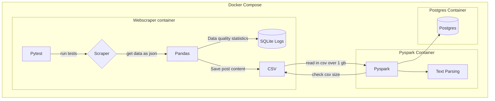

## Data Pipeline Project - Scraping Reddit r/new

Goals:
- Scrape reddit/r/new posts programatically, simulating "streaming" data ingestion
- Parse scraped nested json data
- Clean excess metadata
- Use pytest for testing
- Track Data Quality Metrics
- Store metrics in SQLite database
- Write chunks of data to a csv
- Clean the CSV data
- Insert cleaned data into Postgres
- Dockerize the project
- Use containerized streamlit for a dashboard/displaying outputs

How to Run:

1. Clone the Repository
2. Run the docker commands:

`docker build --tag scraper .`

`docker run scraper:latest`