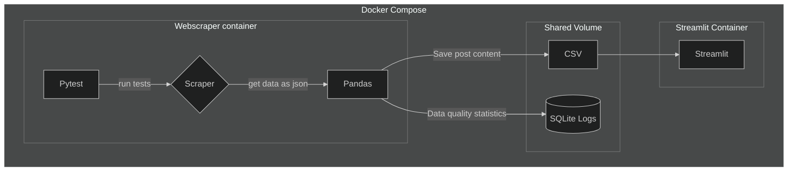

# Data Pipeline Project - Scraping Reddit r/new

## Goals:

- Scrape reddit/r/new posts programatically, simulating "streaming" data ingestion

- Parse scraped nested json data

- Clean excess metadata

- Use pytest for testing

- Track Data Quality Metrics

- Store metrics in SQLite database

- Write chunks of data to a csv

- Clean the CSV data

- Dockerize the project

- Use containerized streamlit for a dashboard/displaying outputs

## How to Run:

1. Clone the Repository

2. Run the docker commands in the root directory (which contains the docker compose file):

`docker volume create cross_vol`

`docker compose build`

`docker compose up`

3. After it finishes running, to remove the container:

`docker compose down --volumes`

`docker volume prune`

`docker rmi -f <image_name>`

`docker images`

(if you've forgotten the container name)

^^ remove the image, IMPORTANT as it will likely be 1+GB as it includes the full python distro + packages

