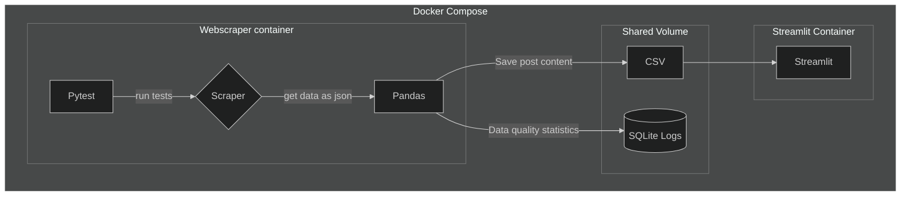

# Data Pipeline Project - Scraping Reddit r/new

## Project Structure:

- Scrape reddit/r/new posts programatically, simulating "batch" data ingestion

- Parse scraped nested json data

- Clean excess metadata

- Use pytest for testing

- Track Data Quality Metrics

- Store metrics in SQLite database

- Write chunks of data to a csv

- Clean the CSV data

- Use Docker/Docker Compose for modularity

- Use containerized streamlit app for a dashboard/displaying outputs

## How to Run:

1. Clone the Repository

2. Run the docker commands in the root directory (which contains the docker compose file):

`docker compose build`

`docker compose up`

3. After it finishes running, to remove the container:

`docker compose down --volumes`

`docker image prune`

4. To open the streamlit app, open the Network Url output in the terminal in a browser.

## Alternate options to run it:

1. In the `app` directory, there are instructions to run the scraping portion of the app without using **docker compose**. It can be ran either locally (with a virtual env) or as a lone docker container. 