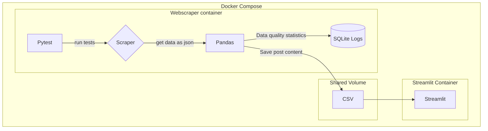

## Data Pipeline Project - Scraping Reddit r/new

Goals:
- Scrape reddit/r/new posts programatically, simulating "streaming" data ingestion
- Parse scraped nested json data
- Clean excess metadata
- Use pytest for testing
- Track Data Quality Metrics
- Store metrics in SQLite database
- Write chunks of data to a csv
- Clean the CSV data
- Insert cleaned data into Postgres
- Dockerize the project
- Use containerized streamlit for a dashboard/displaying outputs

How to Run:

1. Clone the Repository

2. Run the docker commands in the root directory:

`docker build --tag scraper .`

`docker run -it scraper:latest`

3. After it finishes running, to remove the container:

`docker kill <container_name>`

^^ this will kill the container process

`docker ps`

(if you've forgotten the container name)

`docker container prune` 	

^^ remove the container

`docker rmi -f <image_name>`

`docker images`

(if you've forgotten the container name)

^^ remove the image, IMPORTANT as it will likely be 1+GB as it includes the full python distro + packages
