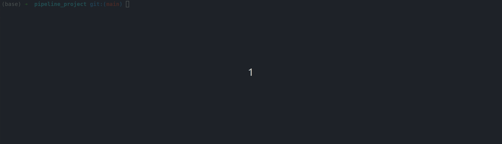

# Data Pipeline Project - Scraping Reddit Posts

## Overview:

* The goal of this project was to create a nice framework for scraping text data from reddit. 

* It scrapes new posts from Reddit with no preference for topic or subreddit. 

* I wanted to get more familiar with using multiple docker containers and volumes to share data and so the three main pieces of the project are a container for scraping the data (and logging results), a data volume for storage (sqlite/csv), and a container running a Streamlit app to visualize/explore the data a bit.

### Summary:

* I learned there are a number of bots (which are not always obviously named) posting to various subreddits. Some sanctioned (automoderators) and some likely not (spamming crypto-subs, financial advice, other advertising). The most popular subreddits (by number of subscribers) do not exclusively get the most posts, due to the number of (likely) bots.

## Project Structure:

- Scrape new Reddit posts programatically, simulating "batch" data ingestion

- Parse scraped nested json data

- Clean excess metadata

- Use pytest for testing

- Track Data Quality Metrics

- Store metrics in SQLite database

- Write chunks of data to a csv

- Clean the CSV data

- Use Docker/Docker Compose for modularity

- Use containerized streamlit app for a dashboard/displaying outputs

## Config settings:

In the `app/config.yml` file, you can change the sleep time between http requests (don't make it too small or you'll get banned), the number of posts to get for each request, and the total number iterations/calls to make.

## How to Run:

1. Clone the Repository

2. Run the docker commands in the root directory (which contains the `compose.yml` file):

`docker compose build`

`docker compose up`

3. To open the streamlit app, open the Network URL output in the terminal in a browser.

4. After it finishes running, to remove the container:

`docker compose down --volumes`

5. After running, to clean up containers/volumes (assuming you don't have others on your system you need to save):

`docker system prune -a`

##### Note: If you refresh the streamlit app with "Ctrl + R", it will update the data to the lastest scraped while the scraper is continuously running.

## Alternate options to run it:

In the `app` directory, there are instructions to run the scraping portion of the app without using **docker compose**. It can be ran either locally (with a virtual env) or as a single docker container. 