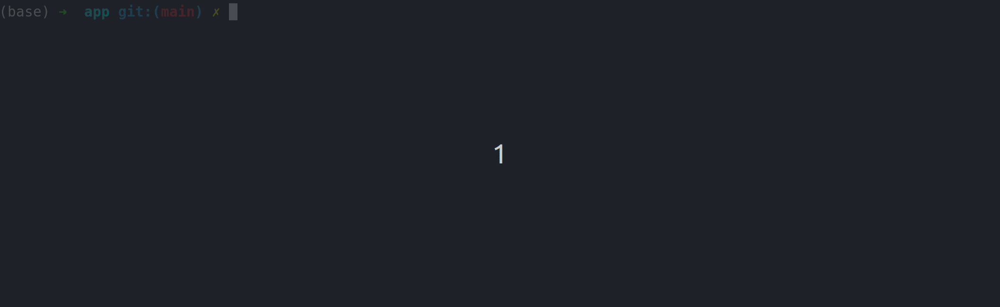

# Scraping App

## How to Run:

##### Edit configs:
You can change the config file `config.yml` to determine how many posts to scrape at once and how many iterations to scrape for.

Additionally, the `sys.out` config parameter will allow the scraper to print data statistics for each "run" of the scraper, if set to True (default is False).

You can run the scraper with OR without Docker. Either way, the cleaned response data will be saved in the data folder.

(If running the scraper alone, the streamlit app will not function unless you change the path from `"/data/response.csv"` to `"../app/data/response.csv"`.)

### Running without Docker:
---

##### Virtual ENV and Requirements:
[Create and activate a virtual env](https://docs.python.org/3/tutorial/venv.html)

`pip install -r requirements.txt`

##### Tests:

Tests can be ran in this directory with simply the `pytest` command, after installing requirements.

##### Run the app:

`python scraper_main.py`
or
`py scraper_main.py`  #on windows

(above shown with `sys_out: True` in the config file)

##### Analysis:

`jupyter-notebook analysis.ipynb`

##### To view the sqlite database of scraping iterations:

`python sql_checker.py`

### Running with Docker:
---
##### Build the container:

`docker build --tag scraper .`

(Note: if you change the config settings, you will need to build the image again. The layers are cached, so it should build quite quickly after the first time building it.)

##### Run the container:

`docker run -d scraper:latest`

(the container name/hash will be printed on the next line, only the first couple characters are needed to refer to it as they are almost always unique)

ie. container **ac70c6716f2a** could be referenced as **ac70** without issue

##### To view the logs:

`docker exec <container_name> tail -f scraper.log`

##### To view the sqlite database of scraping iterations:

`docker exec <container_name> python sql_checker.py`