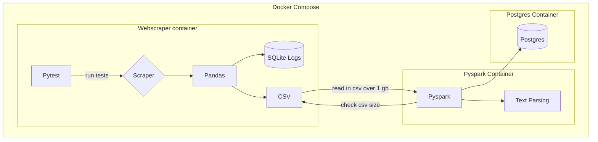

```mermaid
graph TD
    subgraph Docker Compose
    subgraph Webscraper container
    C --> D[(SQLite Logs)]
    B{Scraper} --> C[Pandas]
    C --> E[CSV]
    Z[Pytest] --> |run tests|B
    end
    subgraph Pyspark Container
    E[CSV] --> |read in csv over 1 gb|F[Pyspark]
    F[Pyspark] --> |check csv size|E[CSV]
    F --> G[Text Parsing]
    end
    F --> P
    subgraph Postgres Container
    P[(Postgres)]
    end
    end
    
```